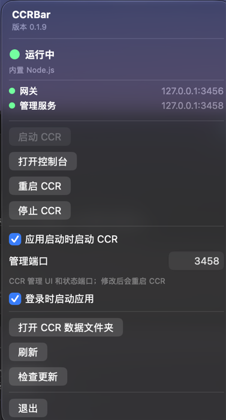

<p align="center">
  
</p>

# CCRBar

**原生 macOS 菜单栏控制器，管理 [Claude Code Router (CCR)](https://github.com/musistudio/claude-code-router)。**

CCRBar 主要解决一个很具体的问题：只想查看状态、启停 CCR 时，不必为此常驻一套 WebView/Electron 渲染器。它本身无 Electron、无 Tauri、无 WebView，使用纯 SwiftUI 把 CCR 的启停、状态监控和常用入口收进菜单栏。已通过 Apple 公证，支持 Sparkle 自动更新，界面跟随系统语言（中文 / English）。

[](https://github.com/misswell/CCRBar/releases/latest)


## 为什么要 CCRBar

如果只是查看 CCR 状态或重启服务，常驻一个 WebView 控制界面会带来不必要的内存开销。CCRBar 用原生 SwiftUI 提供菜单栏控制层，不加载 WebView，也不嵌入 CCR Dashboard；需要完整管理界面时，再按需打开 CCR 原有 Dashboard。

## 下载安装

1. 从 [Releases](https://github.com/misswell/CCRBar/releases/latest) 下载 `CCRBar-x.y.z-macos.zip`；
2. 解压后将 `CCRBar.app` 拖入「应用程序」；
3. 启动后菜单栏出现状态图标，CCR 正常运行时显示绿色圆点。

已安装的版本会自动检查更新（每天一次），也可以在菜单里点「检查更新」。

## 功能

- 菜单栏实时状态指示（Running / Stopped / Starting / Error）+ Gateway / Management 双端口指示灯
- 启动 / 停止 / 重启 CCR，一键打开 CCR Dashboard（`ccr ui`）
- 打开 CCR 数据目录（`~/.claude-code-router`）
- 登录启动（SMAppService）+ App 启动时自动拉起 CCR
- 在线更新（Sparkle，每天自动检查一次，可手动检查）
- 自动识别桌面版 `ccr-app` 自带的 Node.js，或从本机已安装版本中选择 Node.js 22+
- 修改 CCR Management 端口（默认 `3458`，提交后自动重启 CCR）

## 环境要求

- macOS 14+
- [`@musistudio/claude-code-router`](https://github.com/musistudio/claude-code-router)（全局安装，或使用其桌面版）

```bash
npm install -g @musistudio/claude-code-router
```

## 设计原则

- 不使用 Electron / Tauri / Chromium / WKWebView
- 控制层保持原生、轻量，避免为菜单栏入口常驻 WebView 渲染器
- 不重写 Claude Code Router，只做启停 + 状态监控 + 快捷入口
- CCR 官方 CLI 是唯一的核心逻辑来源

## 自动识别与端口

启动时会优先检测官方 `ccr` CLI；如果没有，则检测 Claude Code Router 桌面版提供的
`~/.claude-code-router/bin/ccr-app`。桌面版使用 Electron 自带的 Node.js，不依赖系统 Node.js。
普通 CLI 模式会扫描 PATH、nvm、fnm、asdf、mise、Volta 等常见安装位置，选择最高的 Node.js 22+
版本，仅为 CCR 进程临时调整 PATH，不会修改用户的 shell 配置。

菜单栏里的 `Management Port` 对应 CCR 的管理服务端口（CLI 的 `--port` 参数），默认是 `3458`。
Gateway 端口仍由 CCR 自身配置管理，默认是 `3456`。

## 最近更新

- `v0.1.13`：明确 CCRBar 以避免 WebView/Electron 常驻渲染器内存开销为主要目标。
- `v0.1.12`：新增 CCRBar 产品官网，补充下载入口与运行时识别说明。
- `v0.1.11`：降低长期运行的内存增长——及时回收 Dashboard 子进程、限制命令输出缓存，并减少无变化状态的重复刷新。
- `v0.1.10`：本地化修复——命令失败错误信息在中文系统正确显示；补齐两条桌面版运行时提示的翻译。
- `v0.1.9`：修复「打开 CCR 数据文件夹」报错 -50；新增简体中文界面（跟随系统语言）。
- `v0.1.8`：修复 Stop 后菜单状态不刷新、自动启动竞态，以及桌面版运行时误报未安装。
- `v0.1.5`：菜单显示产品名和版本；`Start CCR` 与 `Stop CCR` 按当前状态互斥。

## 构建

```bash
xcodegen generate
xcodebuild -project CCRBar.xcodeproj -scheme CCRBar -configuration Release build
```

在线更新的发布流程见 [docs/UPDATES.md](docs/UPDATES.md)。

## 项目结构

```
CCRBar/
├── App/
│   ├── CCRBarApp.swift
│   └── AppState.swift
├── Models/
│   ├── AppSettings.swift
│   └── CCRStatus.swift
├── Services/
│   ├── CCRExecutableResolver.swift
│   ├── CCRServiceManager.swift
│   ├── CCRStatusMonitor.swift
│   ├── CommandRunner.swift
│   ├── LoginItemManager.swift
│   └── UpdateManager.swift
├── Views/
│   ├── MenuBarView.swift
│   ├── StatusView.swift
│   └── SettingsView.swift
├── Resources/
│   ├── CCRBar.entitlements
│   └── Info.plist
└── Utilities/
    └── Version.swift
```

`CCRBar/Resources/Info.plist` contains the Sparkle update feed and public signing key.

---

## English

CCRBar is a **native macOS menu bar app** for controlling [Claude Code Router](https://github.com/musistudio/claude-code-router) — start/stop, live gateway & management status, quick access to the dashboard and data folder. It exists so you do not have to keep a WebView/Electron renderer resident just to check CCR or restart the service: CCRBar's own control surface is pure SwiftUI, with no Electron, no WebView, and no embedded dashboard. The full CCR Dashboard opens only when you ask for it. It is notarized by Apple, uses Sparkle for automatic updates, and follows your system language (English / 简体中文).

**Install:** grab the latest zip from [Releases](https://github.com/misswell/CCRBar/releases/latest), drag `CCRBar.app` into `/Applications`, and you're set. Requires macOS 14+ and the CCR CLI or desktop app.

---

## 👨‍💻 作者的其他开源项目

**[MacPilot](https://github.com/misswell/MacPilot)** —— 开源 macOS 菜单栏效率工具箱（Swift 原生 · 零第三方依赖）：应用自动退出规则、BLE 靠近解锁、窗口切换器、剪贴板历史、平滑滚动、画中画、录屏、截图贴图等 11 合 1，Apple 公证签名，[免费下载](https://github.com/misswell/MacPilot/releases/latest)。觉得有用欢迎点个 Star ⭐
